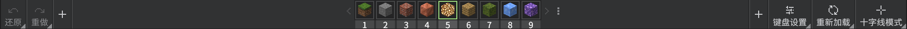

# 用户界面
编辑器有独特的用户界面，本文档将概述编辑器的用户界面。

## 操作栏

操作栏提供了一些快速功能，比如**撤销**和**重做**，这些功能会影响你对世界所做的事情：

| 命令 | 快捷键 |
|:-------|:-------|
| 撤消 | 按`Ctrl+Z` |
| 重做 | 按`Ctrl+Y` |
| 键盘设置 | - |
| 重新加载 | - |
| 十字线模式 | 按`Ctrl+Tab` |

要向工具条添加操作，请按右侧或左侧的`[+]`并从菜单中选择要添加到操作栏的操作，要删除操作，请单击操作左下角的小三角形，然后从下拉菜单中选择**清除**。

